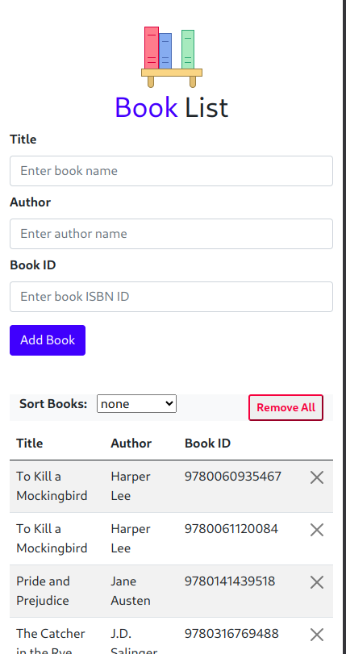
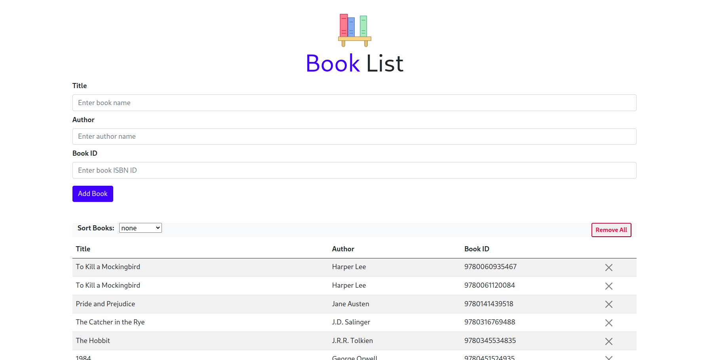

# Siksha Library Website

This website allows users to manage their Books, which includes add, remove, and sort their Books.

<p align="center">
  <a href="#">
    
  </a>
</p>

<h3 align="center">Mobile version</h3>

<hr>
<p align="center">
  <a href="#">
    
  </a>
</p>

<h3 align="center">Desktop version</h3>


## How to use Library

1. ### <a href="">visit Siksha Library Website</a>


## Deeply Knowing What's going on this Website

#### Very top section import books data and get nodes by their Ids 

### JavaScript Classes

**Class-Based Structure for Book**

class encapsulates the details of book.


```
class Book {
  constructor(title, author, ISBN) {
    this.title = title;
    this.author = author;
    this.ISBN = ISBN;
  }
}
```
1. **Properties:**

   - `title`: This property stores the book's title
   - `author`: This property stores the book's author
   - `ISBN`: This property stores the book's ISBN

   This class efficiently bundles these properties, ensuring they are logically organized and encapsulated.


**Class-Based Structure for Siksha Library**

class encapsulates the data of books and method that manipulate books data.

1. **Properties:**
```
static books = [];
```

- `Books`: this property Store list of books object 


2. **Methods:**

```
static getBooks() {
    if (
      localStorage.getItem("books") === null ||
      localStorage.getItem("books") === undefined
    ) {
      {
        this.books = bookData;
        localStorage.setItem("books", JSON.stringify(this.books));
      }
    } else {
      this.books = JSON.parse(localStorage.getItem("books"));
    }
    return this.books;
  }
```

   - `getBooks()`: This method allows users to get Books from localStorage,if user first time open this website than localStorage empty for this website then Some books Stores on localStorage. If user already use this website than this method return already store books

 ```
 static addBook(book) {
    this.books.push(book);

    localStorage.setItem("books", JSON.stringify(this.books));
  }
  ```

   - `addBook(book)`: Users can utilize this method to add book, then updates the localstorage and UI accordingly.

```
static removeBook(ISBN) {
    this.books = this.books.filter((book) => book.ISBN !== ISBN);
    localStorage.setItem("books", JSON.stringify(this.books));
  }
```
- `removeBook(ISBN)`: Users can utilize this method to remove book. 

```
static removeAllBooks() {
    this.books = [];
    localStorage.setItem("books", JSON.stringify(this.books));
  }
```
- `removeAllBooks()`: Users can use this method to remove all books.

<details>

  <summary>show sort(headName) method contents</summary>

```
  static sort(headName) {
    switch (headName) {
      case "title":
        this.books.sort((a, b) => {
          if (a.title > b.title)
            return 1
          else if (a.title < b.title)
            return -1
          else return 0
        })
        break;
      case "author":
        this.books.sort((a, b) => {
          if (a.author > b.author)
            return 1
          else if (a.author < b.author)
            return -1
          else return 0
        })
        break;
      case "bookId":
        this.books.sort((a, b) => {
          if (a.ISBN > b.ISBN)
            return 1
          else if (a.ISBN < b.ISBN)
            return -1
          else return 0
        })
        break;
        default :
      DomManipulator.showAlert("none selected nothig to sort", "bg-info");


    }
    localStorage.setItem("books", JSON.stringify(this.books));
  }
```

</details>

- `sort(headName)`: This method use for sort books by `title`, `author` and `book id`

### Switch Statements

**Switch Statements for User Actions:**

The JavaScript effectively uses a `switch` statement to handle user actions:

When the user selects one of option from Dropdown then  corresponding swicth cases execute and perform appropriate operation

``cases to be match ``

- **title**: if this case matched then Books sorted by title 

- **author**: if this case matched then Books sorted by author 

- **title**: if this case matched then Books sorted by bookId 

- **default**: when user selected default that is none then pop  up show on UI for ensuring the user clear feedback.

This `switch` statement enhances code readability and maintainability.


**Class-Based Structure for DomManipulator**

- `This class encapsulted method for DOM Manipulation`

1. **Methods:**

```
  static showAlert(message, className, color) {
    {
      alert.classList.add(className, color);
      alert.appendChild(document.createTextNode(message));
      // alert.style.display = "block";
      // clear alert message after 4 esc
      setTimeout(() => {
        alert.textContent = "";
        alert.classList.remove(className);

        // alert.style.display = "none";
      }, 4000);
    }
  }
```

- `showAlert(message, className, color)`: This method show pop up at the top of the page for ensuring to provide clear feedback to user, like message : `Please fill in all fields` , `Book id must me numeric value` and `book added to Siksha Library`

<br>

<details>
  <summary>show addBook(e) method contents</summary>

```
static addBook(e) {
    e.preventDefault();
    const bookISBN = bookId.value;
    try {
      if (title.value === "" || author.value === "" || bookISBN === "") {
        throw Error("Please fill in all fields");
      } else {
        // True if  character Found other than [0-9] number
        if (bookISBN.match(/\D/g)) throw Error("Book id must me numeric value");
        if (bookISBN.length < 13)
          throw Error("ISBN number must be greater than 13 digit");
        //  check book already added or not
        const books = Siksha Library.getBooks();

        books.forEach((book) => {
          if (book.ISBN == bookISBN) throw Error("Book ID already registered");
        });

        // add to Object
        const book = new Book(title.value, author.value, bookISBN);
        Siksha Library.addBook(book);
        // add book to DOM
        const row = document.createElement("tr");
        row.innerHTML = `
      <td>${book.title}</td>
      <td>${book.author}</td>
      <td>${book.ISBN}</td>
      <td><button id=${book.ISBN} class="btn-close btn"></button></td>
      `;
        list.appendChild(row);
        // clear after insertion
        title.value = "";
        author.value = "";
        bookId.value = "";
        DomManipulator.showAlert("book added to Siksha Library", "bg-success");
      }
    } catch (e) {
      DomManipulator.showAlert(e, "bg-danger", "text-white");
    }
    finally {
      console.log("Application Works fine")
    }
  }
```
</details>

<br>


- `addBook(e)`: This method use to add book on UI and other place. In this method check user provided book details and then do further operation. Also use Try-Catch-Finally Statements to handle error

### Try-Catch-Finally Statements

Robust error handling is a key feature of `try-catch-finally` statements to ensure a smooth and secure user experience:

- **Try Block**: Within the `try` block, each user action is attempted. When user click on `add book`option then this block of code exceute then  check `any field empty` if any field empty then throw Error. `Book id ` if book id not numeric or less than 13  or book id already inserted throw error

- **Catch Block**: In the event of an error call showAlert() that generates user-friendly error messages as pop up. This ensures that users receive clear and informative feedback about the nature of the issue.

- **Finally Block**: The `finally` block guarantees log in console to show that everything is work fine

```
  static removeBook(e) {
    if (e.target.classList.contains("btn-close")) {
      Siksha Library.removeBook(e.target.getAttribute("id"));
      e.target.parentElement.parentElement.remove();
    }
  }
```

- `removeBook(e)`: This method use to remove book from DOM and invoked Siksha Library.removeBook() method for further operation


```
static sort(e) {
    console.log(e.target.value);
    Siksha Library.sort(e.target.value)
    main()
  }
```

- `removeAllBooks()`: This method use to remove all books from DOM and invoked Siksha Library.removeBook() method for further operation

```
static sort(e) {
    console.log(e.target.value);
    Siksha Library.sort(e.target.value)
    main()
  }
}
```
- `sort(e)`: This method sort Books order by invoked  Siksha Library.sort(e.target.value) method and Update DOM by invoked main() method

<br>

<details>
  <summary>show addBook(e) method contents</summary>

```
function  main() {
  const books = Siksha Library.getBooks();
  list.innerHTML = "";
  books.forEach((book) => {
    const row = document.createElement("tr");
    row.innerHTML = `
<td>${book.title}</td>
<td>${book.author}</td>
<td>${book.ISBN}</td>
<td><button id=${book.ISBN} class="btn-close btn"></button></td>
`;
    list.appendChild(row);
  });
}

</details>
<br>

#### main() function is the try point of Application

```
- `At the the last :` add EventListener to appropriate nodes